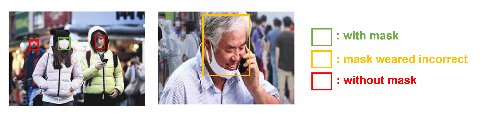

<h1 align="center">
    <p>Real-time Face Mask Detector using Webcam</p>
</h1>

This project is real-time face mask detection using webcam. 

It performs face mask detection and classification on the live cam stream using the FasterRCNN model trained on the [Kaggle dataset](https://www.kaggle.com/andrewmvd/face-mask-detection). Training and execution of CNN models is based on PyTorch.
Model architecture, model training, pipeline, etc. were referenced from other great resources. The codes referenced are summarized below.

- Capable of predicting muliple faces
- 3 types of results  

        🟢 with mask  
        🟡 mask weared incorrect  
        🔴 without mask 

## Objectives
Now that we live in the era of COVID-19, the importance of wearing a mask in our daily life has already been emphasized several times. According to a paper in the international journal Lancet, wearing a mask correctly can reduce the risk of infection by more than 85%.

So, we devised a Face Mask Detector. Based on Livecam, it automatically detects whether people are wearing masks or not. Thus, it can utilize to warn people who do not wear the mask or who use the mask improperly to wear it correctly.

## Data

- [Kaggle Face Mask Detection dataset](https://www.kaggle.com/andrewmvd/face-mask-detection)
    - 853 pngs & xmls
    - approximately 7:4:1 for with mask, without mask, mask weared incorrect
 
- To resolve data imbalance between labels, we added additional images obtained by crawling.
    - add 180 **mask weared incorrect** pngs & xmls

## Method

- Model architecture: FasterRCNN
- The Number of traing epochs : 25
- Learning Rate : 1e-2
- Optimization method : SGD


## Results

<div align="center">
  
</div>

## Dependencies

- Python 3.6+
- PyTorch 1.7.0+
- imutils
- necessary CUDA packages

## Getting started

1. Clone this repository
    ```
    # Install git-lfs
    curl -s https://packagecloud.io/install/repositories/github/git-lfs/script.deb.sh | sudo bash
    sudo apt install git-lfs

    # Clone repository
    git clone https://github.com/shourya2002-geek/FacemaskDetector.git
    cd Face-mask-detector
    ```
2. Donwload data from [kaggle](https://www.kaggle.com/andrewmvd/face-mask-detection)

    * If you want to review data use `./src/data_review.ipynb`


4. Inference
    ```
    python inference.py --model "/your/trained/model/path/model.pth"
    ```


## Future works

- Long hair is recognized as a black mask 
- Accuracy varies with distance


## External code and References

This project would not have been possible without following great resources.

- [jahnavi-prasad's face-mask-detection](https://github.com/jahnavi-prasad/face-mask-detection) 
- [daniel601's kaggle notebook](https://www.kaggle.com/daniel601/pytorch-fasterrcnn)


